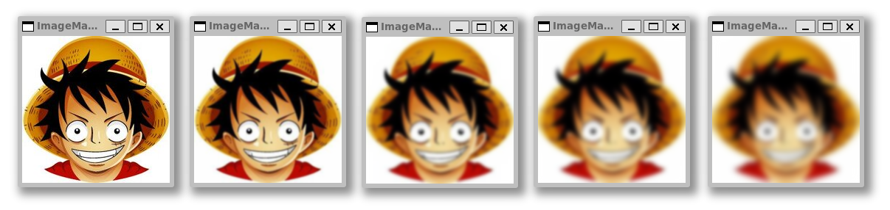

# From-scratch Image Processing Algorithm Implementations
This is a collection image processing algorithms, implemented from scratch in python. Image handling is done with the PIL library and computation is with NumPy.

## Table of Contents

### Edge Detection

- #### [Sobel Edge Detection](https://github.com/kathirmeyyappan/simple-image-processing-algorithms/#sobel-edge-detection-1)

- #### [Canny Edge Detection](https://github.com/kathirmeyyappan/simple-image-processing-algorithms/#canny-edge-detection-1)

### Blur Algorithms

  - #### [Gaussian Blur](https://github.com/kathirmeyyappan/simple-image-processing-algorithms/#gaussian-blur-1)

  - #### [Box Blur](https://github.com/kathirmeyyappan/simple-image-processing-algorithms/#box-blur-1)

  - #### [Median Blur](https://github.com/kathirmeyyappan/simple-image-processing-algorithms/#median-blur-1)

### Cropping and Resizing Algorithms

  - #### [Simple Crop](https://github.com/kathirmeyyappan/simple-image-processing-algorithms/#simple-crop-1)

  - #### [Nearest Neighbor Interpolation](https://github.com/kathirmeyyappan/simple-image-processing-algorithms/#nearest-neighbor-interpolation-1)

  - #### [Bilinear Interpolation](https://github.com/kathirmeyyappan/simple-image-processing-algorithms/#bilinear-interpolation-1)

  - #### [Box Sampling](https://github.com/kathirmeyyappan/simple-image-processing-algorithms/#box-sampling-1)

### Other Algorithms

  - #### [Greyscale](https://github.com/kathirmeyyappan/simple-image-processing-algorithms/#greyscale-1)

  - #### [Brightness](https://github.com/kathirmeyyappan/simple-image-processing-algorithms/#brightness-1)

## Sobel Edge Detection
Sobel edge detection is an algorithm which highlights the edges of an image based on intensity changes. The first step in this is to greyscale the image. This allows us to map the color values as intensities. From here, we apply noise reduction (I used imports from my Gaussian and median blur implementations). Finally we approximate the changes in intensity to identify edges. These edges are simply discrete derivative approximations made through preset kernels that are convolved with the image. For more info on how Sobel edge detection works, see [here](https://en.wikipedia.org/wiki/Sobel_operator)

My implementation of the Gaussian blur algorithm is in [sobel_edge_detector.py](src/edge_detection_algorithms/sobel_edge_detector.py). To run this file, run this from the root: ```python3 src/edge_detection_algorithms/sobel_edge_detector.py -f [FILEPATH]```, where the filepath is from the root (e.g. ```images/luffy.py```). On the left is the original image and on the right is it run through the Sobel edge detector.

<p align="center">
  
</p>

As can be seen, the edges are highlighted with varying intensity and thickness based on the strength and range of the changes in color. The Sobel edge detection method is useful for visualizing edges, but because it does not show thin edges with applicable detail, it is not as useful in general.

## Canny Edge Detection
TBD

## Gaussian Blur
Gaussian blur is a blur algorithm which maintains detail well due to assigning weights based on distance from the original pixel. It makes use of the Gaussian function (also known as 'normal distribution' and 'bell curve') to assign weights when blurring per-pixel. When looking at how to convolve a pixel's surrounds to its own new value, we look to the Gaussian function, centered around this pixel in 2 dimensions, to assign weights for how each of the surrounding pixels will contribute to the center pixel's new RGB values. 

This works because when stretching out to infinity, the integral under a Guassian function will be 1.00. Of course, after around 3 standard deviations, the effect is negligible. So, the algorithm that I've attempted to implement from scratch uses a kernel that is constructed from the Gaussian function in 2 dimensions (shown below).

<p align="center">
  
</p>

The kernel is then normalized so the sum of its elements is 1.00 per color and convolved (using the Hadamard product) with the matrix containing the corresponding pixel and its surroundings. This value is stored in the pixel's corresponding spot in the new image. The values are then summed up per color in the RGB 1 x 3 matrix, which finally yields the value for one pixel. This processes is repeated on every pixel of the image. To read more about Gaussian blur, see [here](https://en.wikipedia.org/wiki/Gaussian_blur). 

My implementation of the Gaussian blur algorithm is in [gaussian_blur.py](src/blur_algorithms/gaussian_blur.py). To run this file, run this from the root: ```python3 src/blur_algorithms/gaussian_blur.py -f [FILEPATH] -s [SIGMA_VALUE]```, where the filepath is from the root (e.g. ```images/luffy.py```) and sigma is the strength (typically an integer between 1 and 10 inclusive for reasonable results). 

Larger files and sigma values take significantly longer beause of the computationally expensive nature of running Gaussian blur from scratch. Surely, PIL and other image handling libraries utilize advanced optimization techniques. As these implementations are for my own educational purposes and are meant to be semantically understandable, I will leave things as are. Below is an example of running (from the root) ```python3 src/blur_algorithms/gaussian_blur.py -f images/luffy.jpg -s SIGMA``` for ```SIGMA``` ∈ [1, 2, 3, 4] along with the original image (i.e. ```SIGMA``` = 0).

<p align="center">
  </img>
</p>

## Box Blur
Box blur is the most simple blur algorithm. It takes the average RGB values of all pixels within a given distance of the target pixel. Because it uses a simple average, it is quite easy to implement iteratively, where we just take the arithmetic mean of all the pixels in the needed range. This implementation is in [box_blur.py](src/blur_algorithms/box_blur.py). To run this file, run this from the root: ```python3 src/blur_algorithms/box_blur.py -f [FILEPATH] -r [RADIUS]```, where the filepath is from the root (e.g. ```images/luffy.py```) and radius corresponds to the range from which we take the mean.

Alternatively, we can use a moving window identically to the Gaussian Blur algorithm where our kernel matrix consists of uniform values to represent identical weights in a "weighted" average. To learn more about box blur, see [here](https://en.wikipedia.org/wiki/Box_blur). A moving window kernel where our given radius is 1 is shown below:

<p align="center">
  </img>
</p>

This implementation (made because most of the groundwork was laid in [gaussian_blur.py](src/blur_algorithms/gaussian_blur.py)) can be found in [box_blur_moving_window.py](src/blur_algorithms/box_blur_moving_window.py). This file may be run in the same way as [box_blur.py](src/blur_algorithms/box_blur.py).

Below is an example of running (from the root) ```python3 src/blur_algorithms/blur_algorithms/box_blur.py -f images/luffy.jpg -r RADIUS``` for ```RADIUS``` ∈ [3, 6, 9, 12] along with the original image (i.e. ```RADIUS``` = 0). These radius values roughly correspond to the Gaussian blur ```SIGMA``` values of 1, 2, 3, and 4 because their respective kernel sizes are equal in my implementation (which used a standard deviation of 3 for the Gaussian distribution kernel).

<p align="center">
  </img>
</p>

As can be seen above, even though the blur factors are similar, many details are lost in this blur method compared to Gaussian blur. So though it is less computationally expensive, it retains much less detail.

## Median Blur
Median blur is very similar to box blur in that it does a very simple operation over a certain range surrounding the pixel of interest to calculate its new value. The difference is that it will take a median for each of the R, G, and B values over the given range rather than their mean. As such, my implementation, which is in [median_blur.py](src/blur_algorithms/median_blur.py), is very similar to [box_blur.py](src/blur_algorithms/box_blur.py) save for the calculation of the pixel RGB value (which is a median instead of a mean). To run this file, run this from the root: ```python3 src/blur_algorithms/median_blur.py -f [FILEPATH] -r [RADIUS]```, where the filepath is from the root (e.g. ```images/luffy.py```) and radius corresponds to the range from which we take the median.

Because we are taking a median, severe outliers do not at all contribute to the image. Sporadic RGB values (which often correspond to "wrong" color pixels in given ranges) are completely ignored in the median calculating process so long as the majority of values in the range are consistent in their RGB values. As such, this blur method is very good at removing unwanted noise from images. Shown below is [forgers_noise.jpg](images/forgers_noise.jpg) (the result of running [forgers.jpg](images/forgers.jpg) through an [image noise adder](https://pinetools.com/add-noise-image)) before and after running median blur with radius 2 (run ```python3 src/blur_algorithms/median_blur.py -f images/forgers_noise.jpg -r 2``` from root).

<p align="center">
  
</p>

As can be seen above, there is actually a quite remarkable amount of noise correction that seems to occur from simply taking the median RGB values. Running median blur on the same image with noise that is not monochronic still yields quite good results, as seen below (run ```python3 src/blur_algorithms/median_blur.py -f images/forgers_noise_2.jpg -r 2``` from root).

<p align="center">
  
</p>

We can compare this to other blur algorithms to show its supremacy in removing noise. Below (from top to bottom) are the median blur, Gaussian blur, and box blur algorithms with ```RADIUS``` (```SIGMA``` for Gaussian blur) values of 0, 1, 2, and 3. As can be seen, median blur completely eliminates noise almost immediately, though edge clarity is lost. Still, even with ```RADIUS``` = 1, median blur outperforms the other algorithms greatly.

<p align="center">
  
</p>

It should also be noted that due to our calculation of median not requiring a moving window of any sort, this algorithm is very fast when compared with Gaussian blur, for instance.

## Simple Crop
Using matrices in R^n, it is quite easy to cut out a 'rectangle' using indices. For image cropping, we take the array representation of the image and simply index it as ```img_arr[row_start : row_end + 1, col_start : col_end + 1]```. The implementation for this is in the simple_crop function from [simple_crop.py](src/resize_algorithms/simple_crop.py).

In [simple_crop_gui.py](src/resize_algorithms/simple_crop_gui.py), I have made a simple graphical user interface for cropping in pygame. To run the file, run this from the root: ```python3 src/resize_algorithms/simple_crop_gui.py -f [FILEPATH]```, where the filepath is from the root (e.g. ```images/luffy.py```). Below is an example use of the GUI.

<p align="center">
  
</p>

## Nearest Neighbor Interpolation
A common and fast method for image resizing lies in nearest neighbor interpolation. This method resizes the new image according to a scale, and maps the pixel value to its (linearly) corresponding position on each axis to the original image. Through this, the image scales in a discrete manner. Some details are lost when the scale is less than 1.00, and scaling up in size causes blocks and streaks to occur due to there being no upscaling correction. My implementation of this method is in [nearest_neighbor_interpolation.py](src/resize_algorithms/nearest_neighbor_interpolation.py).

To run this file, run this from the root: ```python3 src/resize_algorithms/nearest_neighbor_interpolation.py -f [FILEPATH] -s [RESIZE FACTOR]```, where the filepath is from the root (e.g. ```images/luffy.py```) and the resize factor is a float greater than zero corresponding to scale. Shown below (from left to right) is this algorithm run with resizing factors of 0.5, 1, and 2 on [freedom.jpg](images/freedom.jpg).

<p align="center">
  
</p>

## Bilinear Interpolation
The blocky upscaling of nearest neighbor interpolation leaves much to be desired when we upscale to larger sizes. The pixelated nature of the originally smaller image becomes very apparent, after all. To mitigate this effect, we can use bilinear interpolation. This resizing method essentially eliminates apparent blockiness by linearly interpolating for each pixel that corresponds to a point in between discrete RGB values from the original image. Mathematically, this idea is actually quite difficult to explain without diagrams and many redundant equations. See [here](https://en.wikipedia.org/wiki/Bilinear_interpolation) for more about bilinear interpolation.

My implementation of this algorithm can be found in [bilinear_interpolation.py](src/resize_algorithms/bilinear_interpolation.py). As the first paragraph of the wikipedia link describes, I linearly interpolated with weighted averages one axis at a time, using NumPy's rotation method to increase the efficiency of the implementation. To run this file, run this from the root: ```python3 src/resize_algorithms/bilinear_interpolation.py -f [FILEPATH] -s [RESIZE FACTOR]```, where the filepath is from the root (e.g. ```images/luffy.py```) and the resize factor is a float greater than 1.

Now, let us see what kind of differences that bilinear interpolation provides to image resizing. Below, we have two images, both of which are the results of running resizing algorithms (with x5 resizing) on [eren.jpg](images/eren.jpg). To the left, we have the nearest neighbor interpolation result (run ```python3 src/resize_algorithms/nearest_neighbor_interpolation.py -f images/eren.jpg -s 5``` from root). To the right is the bilinear interpolation result (run ```python3 src/resize_algorithms/bilinear_interpolation.py -f images/eren.jpg -s 5``` from root).

<p align="center">
  
</p>

As can be seen above, there is clearly some filled in smoothness when comparing the right image to the left. This is a result of bilinear interpolation mitigating most of the jarring transition that would occur between pixel changes.

## Box Sampling
When we use nearest neighbor interpolation to reduce the size of an an image, we are essentially picking (roughly) equidistant lattice points from the original image to map onto the new image. Because the input to the downsized image only consists of said lattice points, we lose more information the smaller our resizing factor is (by virtue of there being less lattice points), giving rise to aliasing. For example, below (to the left) is [forgers.jpg](images/forgers.jpg) with a 0.2 resize scale (run ```python3 src/resize_algorithms/nearest_neighbor_interpolation.py -f images/forgers.jpg -s 0.2``` from root). Notice how the image lacks some details and feels "grainy".

A solution to this is box sampling. We use all of the lattice points to create a grid of boxes (each one being a rectangular section of pixels from the original image) from which we take average RGB values. With each box corresponding to a pixel in the downsized image, we assign said pixel the average RGB value of the box. With this method, all of the pixels in the original image contribute to the downsized image, effectively introducing a downscale that drastically decreases lost info. Box sampling makes a large difference, as can be seen in its application to the same image (right) below.

<p align="center">
  
</p>

My implementation of this algorithm can be found in [box_sampling.py](src/resize_algorithms/box_sampling.py). To run this file, run this from the root: ```python3 src/resize_algorithms/box_sampling.py -f [FILEPATH] -s [RESIZE FACTOR]```, where the filepath is from the root (e.g. ```images/luffy.py```) and the resize factor is a non-zero, positive float less than 1.

Below we have two images. On the left is [gintama.jpg](images/gintama.jpg) run through [nearest_neighbor_interpolation.py](src/resize_algorithms/nearest_neighbor_interpolation.py) with a resize factor of 0.25. On the right is the same image run through [box_sampling.py](src/resize_algorithms/box_sampling.py) with the same resize factor of 0.25.

<p align="center">
  
</p>

As can be seen, the right image (box sampling) retains much more detail and smoothness by taking all of the original image's pixels into account as opposed to the left one (nearest neighbor interpolation).

## Greyscale
To fully greyscale an image, we take a given pixel and set all of its RGB values to their cumulative average. As such, a pixel, ```< R, G, B >``` would become ```< (R + G + B) / 3, (R + G + B) / 3, (R + G + B) / 3 >```. If we want to implement this operation with varying greyscale strengths, we need only make a weighted average between the original pixel and the fully grey one. This, benig a linear relationship, would directly apply a strength (from 0 to 1) on the image to grey it by that factor.

My implementation of this algorithm can be found in [greyscale.py](src/other_algorithms/greyscale.py). To run this file, run this from the root: ```python3 src/src/other_algorithms/greyscale.py -f [FILEPATH] -s [STRENGTH]```, where the filepath is from the root (e.g. ```images/luffy.py```) and the strength is a float from 0 to 1. Below is an example of this algorithm run on [nichijou.jpg](images/nichijou.jpg) with strengths (top left, top right, bottom left, bottom right) of 0, 0.33, 0.67, and 1.

<p align="center">
  
</p>

## Brightness
Brightness can also be applied very simply. All we need to do is increase all of the RGB values in a given pixel by a constant, capping off the values at 255 above (i.e. if the value exceeds 255, set it at 255) and 0 below. By introducing a brightness constant $b$, which ranges from -1 to 1, as the portion of 255 by which to add/subtract to each RGB value. So, iterating through each pixel's RGB values, we apply: $C = C_0 + b * 255$, then correct for values above 255 and below 0.

My implementation of this algorithm can be found in [brightness.py](src/other_algorithms/brightness.py). To run this file, run this from the root: ```python3 src/src/other_algorithms/brightness.py -f [FILEPATH] -b [BRIGHTNESS FACTOR]```, where the filepath is from the root (e.g. ```images/luffy.py```) and the brightness factor is a float between -1 and 1 (negative values to darken and positive values to brighten). Below is an example of this algorithm run on [saitama.jpg](images/saitama.jpg), with brightness factors of -0.5, -0.25, 0, 0.25, and 0.5 (from left to right).

<p align="center">
  
</p>
